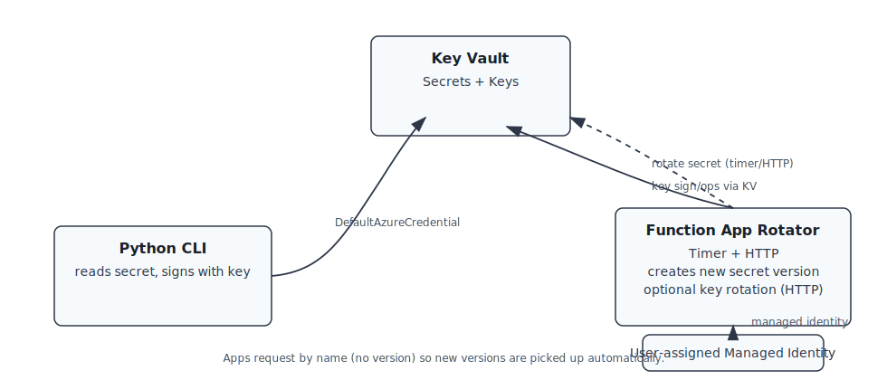

# Azure Key Vault Rotation Demo

Minimal, disposable demo showing how apps consume Key Vault secrets/keys by name (no version) and naturally pick up rotations.

## What's included

- **Infrastructure (Bicep)**: Key Vault (Standard), user-assigned managed identity, Linux Consumption Function App
- **Python CLI**: Reads secret metadata/value and signs data using a Key Vault key
- **Local Dashboard**: Web interface for monitoring and controlling rotations
- **Key Vault Module**: Reusable Python module for Key Vault operations
- **Scripts**: Deploy, configure, seed, rotate, show versions, and destroy Vault Rotation Demo

Minimal, disposable demo showing how apps consume Key Vault secrets/keys by name (no version) and naturally pick up rotations.

What’s included
- Infra (Bicep): Key Vault (Standard), user-assigned managed identity, Linux Consumption Function App.
- Python CLI: Reads secret metadata/value and signs data using a Key Vault key.
- Rotator Function: Timer + HTTP endpoint that creates a new secret version; HTTP can optionally rotate the key.
- Scripts: Deploy, configure, seed, rotate, show versions, and destroy.

Architecture

  

How it works
- The CLI always requests by name (no version), so new versions are picked up automatically.
- The rotator creates a new secret version on a schedule; the HTTP endpoint can also rotate the key.
- Managed identity authenticates the rotator; local dev uses `az login` with `DefaultAzureCredential`.

Quick start
1) Open in a dev container (recommended):
   - With VS Code + Dev Containers extension or GitHub Codespaces.
   - The container installs Azure CLI, Bicep, Node 18 + npm, Azure Functions Core Tools, jq, and Python deps into `.venv`.
2) Deploy infra:
   - `RG=akv-rot-demo LOCATION=eastus PREFIX=akvdemo scripts/deploy.sh`
3) Seed assets:
   - `KV_NAME=<from output> scripts/seed.sh`
4) Use CLI:
   - In the dev container, a `.venv` is created at repo root; activate it first: `source .venv/bin/activate`
   - If running locally (not in dev container), create a venv in `app/python`:
     - `cd app/python && python -m venv .venv && source .venv/bin/activate && pip install -r requirements.txt`
   - `python -m kv_cli read-secret --vault "$KV_NAME" --show-value`
   - `python -m kv_cli sign --vault "$KV_NAME" --data "hello"`
5) View Dashboard:
   - Open web dashboard: `HOST=<functionAppHostname> scripts/open-dashboard.sh`
   - Or visit: `https://<functionAppHostname>/` in your browser
6) Rotate:
   - Secret: `KV_NAME=$KV_NAME scripts/rotate-secret-now.sh`
   - Key: `KV_NAME=$KV_NAME scripts/rotate-key-now.sh`
   - HTTP (secret): `HOST=<functionAppHostname> scripts/rotator-http-rotate.sh`
   - HTTP (secret+key): `HOST=<functionAppHostname> scripts/rotator-http-rotate-both.sh`
   - Or use the dashboard buttons for interactive rotation
7) Destroy: `RG=akv-rot-demo scripts/destroy.sh`

Docs
- See `docs/00-overview.md`, `docs/10-deploy.md`, `docs/20-run-demo.md`, `docs/40-rotator.md`, and `docs/30-cleanup.md`.
